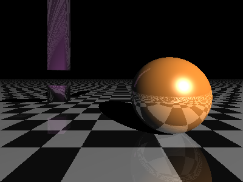

# RayTracing
计算机图形学大作业
```python
# @Time    : 2020/11/23 
# @Author  : lwk
# @Email   : 1293532247@qq.com
# @Software: PyCharm
# @CPU:Razon R5-4600U
```

计算机图形学第二次大作业，简单的光线追踪程序。<br/>
最大迭代次数为10，使用联想小新Pro13 ARE版渲染一次大约一分钟。<br/>
提交作业后会发布于CSDN上。<br/>
可以在平面上生成“长方体”和“球体”两种物体。<br/>
最终效果图如下：<br/>


## 目录

- [使用](#使用)
    - [直接运行](#直接运行)
    - [修改场景](#修改场景)
    - [添加新物体](#添加新物体)

## 使用

### 直接运行

在命令行中运行以下代码

```cmd
python MyRayTracing.py
```

在同级目录下会生成最新的图片

### 修改场景

`scence = [...]`中可以添加自定义的物体到场景中去

### 添加新物体

`add_cube`和`add_sphere`分别是写好的添加长方体和添加球体的函数，可以做新物体的参考。<br/>
如果要添加新的物体，需实现自定义判断和光线相交/计算交点的函数。
